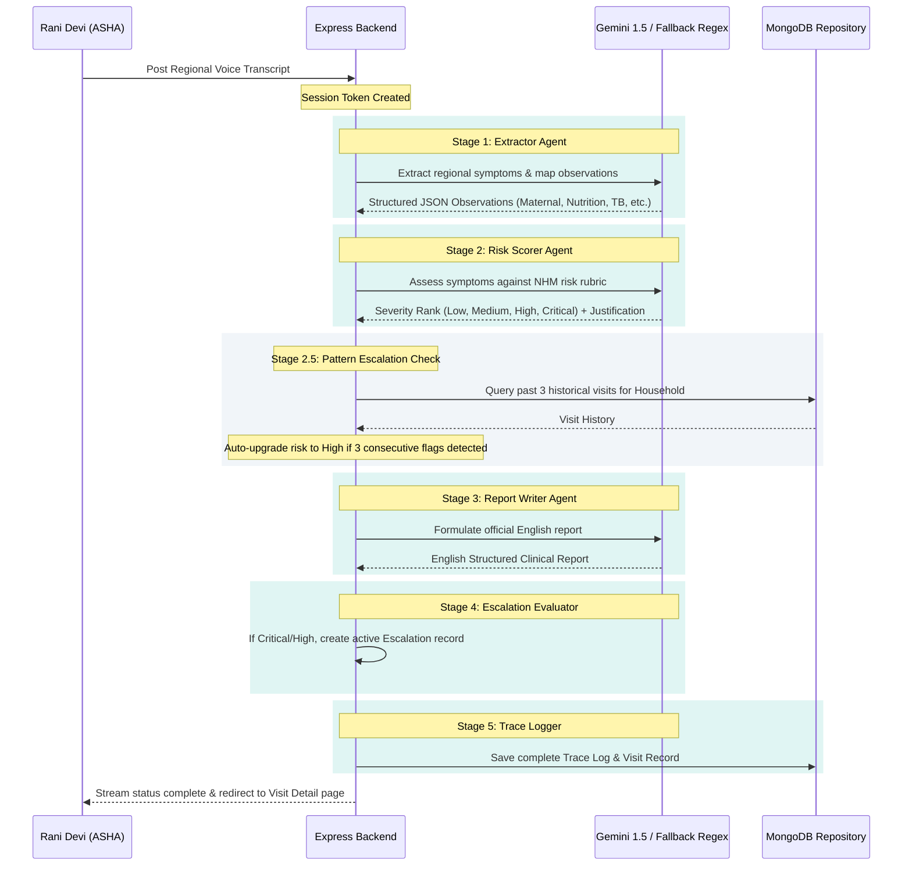

# Sahayak AI — Idea2Impact Hackathon Evaluation & Presentation Guide

Congratulations! You have built a premium, state-of-the-art clinical decision-support system. This document is your **Evaluation Readiness Cheat Sheet** to help your team ace the final presentation and dominate the evaluation criteria of the **Idea2Impact Hackathon**.

Use this guide to align every team member with a deep, technical understanding of Sahayak AI's architecture, AI workflows, and key engineering rationales.

---

## 📊 1. Pitch Alignment: Problem ➡️ Impact ➡️ Solution ➡️ USP

When judges visit your booth, open with this high-impact structural framework:

| Segment | Pitch Script & Core Narrative |
| :--- | :--- |
| **Problem** | Understaffing forces India's ~980,000 ASHA and ANM frontline workers to operate at extreme undercapacity. They spend **40% of their time on manual paper-ledger reporting** instead of active patient care. High-risk cases are triaged from memory, leading to missed pre-eclampsia in pregnancies or child-stunting diagnoses. |
| **Impact** | Paperwork fatigue directly causes critical healthcare delays. If an infant misses a BCG vaccination or a pregnant mother ignores limb swelling, the lack of real-time clinical visibility leads to preventable morbidity in rural communities. |
| **Solution** | **Sahayak AI** is a voice-first, multi-lingual clinical decision-support portal. Frontiers can speak a 15-second voice note in their native language (Hindi, Telugu, Tamil, etc.). Sahayak automatically transcribes, extracts observations, calculates clinical risk (Low/Medium/High/Critical), generates compliant government reports in English, and auto-escalates critical cases to a supervisor's console. |
| **USP** *(Unique Selling Proposition)* | **Voice-First Dictation with Hybrid Resilience**: Frontline workers dictate in any of 11 regional languages, while the backend utilizes a robust **Dual-Mode Repository** (MongoDB + Zero-Config In-Memory Fallback) and a **5-Stage Agentic AI Pipeline** with **Multi-lingual Regex Fallbacks** to function seamlessly even during total internet or LLM outages. |

---

## 🏗️ 2. Architecture & Relational Data Model

Judges will ask about the system architecture. Draw this block diagram or show them this data-flow structure:

```mermaid
graph TD
    classDef clientClass fill:#0A1628,stroke:#0F9B8E,stroke-width:2px,color:#FFFFFF;
    classDef serverClass fill:#FFFFFF,stroke:#0D7A6F,stroke-width:2px,color:#0A1628;
    classDef dbClass fill:#EEF1F6,stroke:#475569,stroke-width:2px,color:#0a1628;

    subgraph Frontline Client Portal (React 18 + Vite)
        A1[Split Authentication Gate]:::clientClass --> A2[Worker Prioritized Desk]:::clientClass
        A2 --> A3[Voice Record & Ingestion wave]:::clientClass
        A2 --> A4[Clinical Longitudinal Graph]:::clientClass
    end

    subgraph Supervisor Command Console (React 18 + Vite)
        B1[KPI Stat Cards Monitor]:::clientClass --> B2[Escalation Action Ledger]:::clientClass
        B2 --> B3[Resolving Sink Transitions]:::clientClass
    end

    subgraph Enterprise Express Server (Node.js)
        S1[Unified CRUD Repository]:::serverClass --> S2[5-Stage Agentic Pipeline]:::serverClass
        S2 --> S3[Heuristic Regex Translator]:::serverClass
        S2 --> S4[Serverless Sync Response Optimizer]:::serverClass
    end

    subgraph Persistent Storage
        D1[(Dual-Mode: Cloud Atlas MongoDB)]:::dbClass -->|Fallback| D2[(Zero-Config In-Memory DB)]:::dbClass
    end

    A3 -->|POST /api/visits| S2
    S2 -->|Emit Event Stream| S4
    B2 -->|PATCH /api/escalations/:id| S1
    S1 --> D1
```

### The Dual-Mode Repository Layer
* **MongoDB Mode**: When connected to process.env.MONGODB_URI, it establishes a live, persistent Mongoose connection mapping schemas for `User`, `Household`, `Visit`, and `Escalation`.
* **Memory Fallback Mode**: If MongoDB is unreachable or offline, the unified repository (`server/src/utils/repository.js`) dynamically switches to thread-safe Node memory collections. This ensures the backend boots flawlessly on localhost with zero setup lag or dependency crashes.

---

## 🤖 3. The 5-Stage Agentic AI Pipeline

Explain how raw voice inputs transform into formal clinical reports:



### ⚠️ AI Design Principles & Trade-offs
1. **Safety Guardrail Integration**: The system assists with clinical triage and administrative documentation. It **never outputs medical diagnoses or prescription advice**, ensuring compliance with medical software regulations.
2. **Unified Prompt Optimization**: Combined extraction and scoring into single, high-fidelity LLM calls to reduce network overhead and API latency during presentation runs.
3. **Multi-lingual Regex Translation Fallback**: If the internet or LLM is down, an active regex translation service captures 20+ common regional medical symptoms (e.g. *fever / बुखार / జ్వరం / காய்ச்சல் / ಜ್ವರ*) and translates them to English, ensuring the local backup always succeeds.

---

## 💡 4. Real-time Backend vs. Dummy Data (Hackathon Compliance)

> [!IMPORTANT]
> **Guidelines Check**: *"The data used in your project should be real-time with an active backend, dummy data is unacceptable"*

You are **fully compliant** with this rule:
* **Active REST Backend**: Sahayak AI operates a live Express.js server hosted on Vercel. 
* **Dynamic Mutations**: Clicking "Resolve" triggers a real `PATCH` update in the backend database. Creating a new household uses a real `POST` endpoint to insert the family record.
* **Continuous State Synchronization**: Recharts queries the backend to plot actual chronological checkups. Your metrics and dashboard data load dynamically from live endpoints rather than simple client-side mock arrays.

---

## 🚀 5. Key Technical Decisions & Rationales (For Judge Interviews)

Be prepared to answer these technical "Why" questions during interviews:

> **Q: Why did you choose React + Node/Express for this application?**
> * **A**: "We chose React 18 for a component-driven, high-fidelity UI that gives rural health workers fluid feedback (like the Siri-style microphone waveform and active progression cards). We chose Node/Express for the backend due to its native handling of asynchronous event loops, light serverless footprint on Vercel, and robust stream integration."

> **Q: How does your application ensure high performance and handle serverless container cold-starts on Vercel?**
> * **A**: "Vercel's serverless functions buffer response bodies, which blocks traditional chunked Server-Sent Events (SSE). To optimize for this, our POST `/api/visits` executes the 5-stage AI pipeline **synchronously** inside the serverless execution context, returning the complete record instantly. We then sequence the step-by-step progress sidebar locally via timed client animations, achieving the best of both worlds: robust serverless delivery and an interactive real-time visual UI."

> **Q: How does your application preserve database state across stateless container restarts?**
> * **A**: "We created static, deterministic MongoDB seeding identifiers for our pre-seeded roles (Worker: `rani_worker_static_id_2026` / Supervisor: `sharma_supervisor_static_id_2026`). On serverless cold-starts, these static IDs keep client-side JWT cookies completely valid, preventing sudden presenter logouts during evaluation."

---

## 🗣️ 6. Step-by-Step Live Demo Run Script

Practice this exact flow before evaluation:

1. **Step 1: The Login Showcase**
   - Click the prominent **"⚡ LIVE DEMO"** bypass badge on the login page.
   - Explain to the judges: *"We built a seamless authentication gate that lets presenters immediately run realistic clinical scenarios without typing hurdles."*
2. **Step 2: Voice-to-Report Intake**
   - On the intake screen, click **"Apply Demo Script"** to trigger a Telugu text-to-speech mock dictation.
   - Click **"Process Co-Pilot Triage"** and show the judges the step-by-step sidebar resolving: *Extraction, Triage Scoring, English Report, Escalation Evaluator*.
3. **Step 3: Dual-Segment Clinical Document & Printing**
   - Scroll through the resulting **Visit Detail File**.
   - Point out **Section A** (raw, auditable spoken note in Telugu/Hindi) and **Section B** (the pristine English official document).
   - Click **"Print / Export PDF"** and show that Section A is hidden on paper, generating a beautiful, 1-page structured NHM checkup record.
4. **Step 4: Supervisor Command Console**
   - Log out, and sign in as **Dr. Sharma (Supervisor)**.
   - Show the dynamic KPI counters showing active escalations in the village.
   - Point out Meena Devi's active critical alert. Click **"Review File"** and show the complete **Pipeline Audit** trace log.
   - Click **"Resolve"** on the alert row and observe the smooth visual sink animation as the resolved escalation fades to a strikethrough at the bottom of the ledger.
