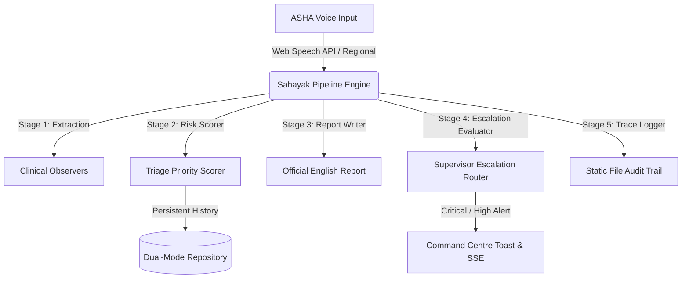

# 🩺 Sahayak AI — National Health Mission (NHM) Decision-Support Portal (2026 Spec)

Sahayak AI is an enterprise-grade, clinical-decision-support system built in compliance with India's National Health Mission (NHM) 2026 digital directives. Tailored for frontline health workers (ASHA/ANM) and Primary Health Centre (PHC) Medical Officers, it empowers rural caregivers with voice-first transcription, automated non-prescriptive health reporting, and real-time clinical escalations in low-resource, low-connectivity settings.

---

## 🏛️ NHM 2026 Strategic Alignment

In rural India, field reporting is historically slow, paper-heavy, and error-prone. Sahayak AI bridges this gap with an **AI-driven diagnostic-triage core** designed to:
- **Empower Frontline Workers**: Multi-lingual voice dictation maps to structured clinical observations.
- **Support clinical Audits**: Real-time status SSE tracing and static log replays maintain end-to-end accountability.
- **Facilitate Immediate Escalations**: Automated severity triage flags Critical/High cases directly to supervising medical officers.
- **Ensure Legal & Clinical Safety**: Output documents are non-prescriptive, legally compliant, and structured solely as decision aids.

---

## ⚡ Key Improvements (Excellence Mode Spec)

This release implements the full suite of **EXCELLENCE MODE** upgrades:
1. **Pulsing Live Demo Mode**: Fully pre-configured live simulation featuring character-by-character multi-lingual voice dictation mockups and custom route-transition clinical triage scales.
2. **Clinical Triage Longitudinal Trend**: Recharts-powered history visualizer tracking household severity vectors over time, colored dynamically by longitudinal trend shifts (Improving vs. Worsening).
3. **Responsive Supervisor Command Centre**: Clinical ledger overhauls with responsive viewcards, persistent summary status bands, and 8-second auto-dismissing critical toast alerts for PHC heads.
4. **Offline Simulation sandbox**: Side-by-side comparative diagnostics running deterministic regex heuristics parallel to standard LLM outputs, calculating precise parity matches.
5. **Real-time Pipeline SSE Tracing**: Live server-sent-event progress indicators showing active pipeline parsing states inside the voice record workspace.

---

## 🔧 Core Architecture



### 🧬 Directory Structure Blueprint
```text
Idea2Impact/
├── client/                     # Premium React 18 + Vite Portal Client
│   ├── src/
│   │   ├── api/                # Axios gateway configurations
│   │   ├── store/              # Zustand Auth state engines
│   │   ├── pages/              # Worker, Supervisor, Detail, and Sandboxes
│   │   ├── components/         # Layout modules & live visualizers
│   │   ├── router.jsx          # Protected route gating layouts
│   │   └── main.jsx            # React root bootstrap
│   └── package.json            # Client package manifests
└── server/                     # Enterprise Node.js + Express Backend
    ├── src/
    │   ├── config/             # DB routers & environmental hooks
    │   ├── models/             # Mongoose & In-Memory fallback schemas
    │   ├── utils/              # Fallback parsers, seeds, and db layers
    │   ├── controllers/        # Domain business logic controllers
    │   ├── routes/             # Protected system paths
    │   ├── services/           # Gemini & Ollama model connectors
    │   ├── agents/             # 5-Stage Orchestration Pipeline
    │   └── server.js           # Server process initializer
    └── package.json            # Backend package manifests
```

---

## 🚀 Deployment & Local Configuration

### 1. Environmental Variable Matrix (`.env`)
Create a `.env` file in the root workspace folder:
```env
PORT=3001
MONGODB_URI=mongodb://localhost:27017/sahayak-ai
JWT_SECRET=super-secret-sahayak-token-key-2026
CLIENT_URL=http://localhost:5173
OLLAMA_API_URL=http://localhost:11434/api/generate
GEMINI_API_KEY=your_gemini_api_key_here
SEED_SAMPLE_DATA=true
```

### 2. Launch the Backend Server
```bash
cd server
npm install
npm start
```
> [!NOTE]
> If MongoDB is offline, Sahayak's **Dual-Mode Repository** automatically triggers thread-safe local In-Memory fallback collections, allowing the entire backend to boot flawlessly with zero configuration step crashes.

### 3. Launch the Client Portal
```bash
cd client
npm install
npm run dev
```
Open [http://localhost:5173](http://localhost:5173) in your default web browser.

---

## 📇 Demonstration Credentials

For full administrative and clinical audit reviews, use the following pre-seeded sandboxes:

| NHM Designation | Portal Login ID | Bypass Credentials |
| :--- | :--- | :--- |
| **ASHA Care Worker** (Rani Devi) | `rani.worker@sahayak.ai` | Click `Rani Devi (Worker)` on Login page |
| **PHC Medical Officer** (Dr. Sharma) | `sharma.supervisor@sahayak.ai` | Click `Dr. Sharma (Supervisor)` on Login page |
| **Live Simulator** (Rani Devi) | *N/A* | Click `⚡ LIVE DEMO MODE` on Login page |

---

## 🛡️ Clinical Integrity & Quality Controls

- **No Prescriptive Content**: AI templates are strictly instructed to translate, clean, and map clinical indicators without prescribing medicine, dosage, or scheduling specific clinical treatments—preventing legal exposure.
- **Privacy Gated Print Sheets**: Print stylesheets explicitly suppress raw field transcript structures, keeping patients' verbal notes safe and confidential on physical paper sheets.
